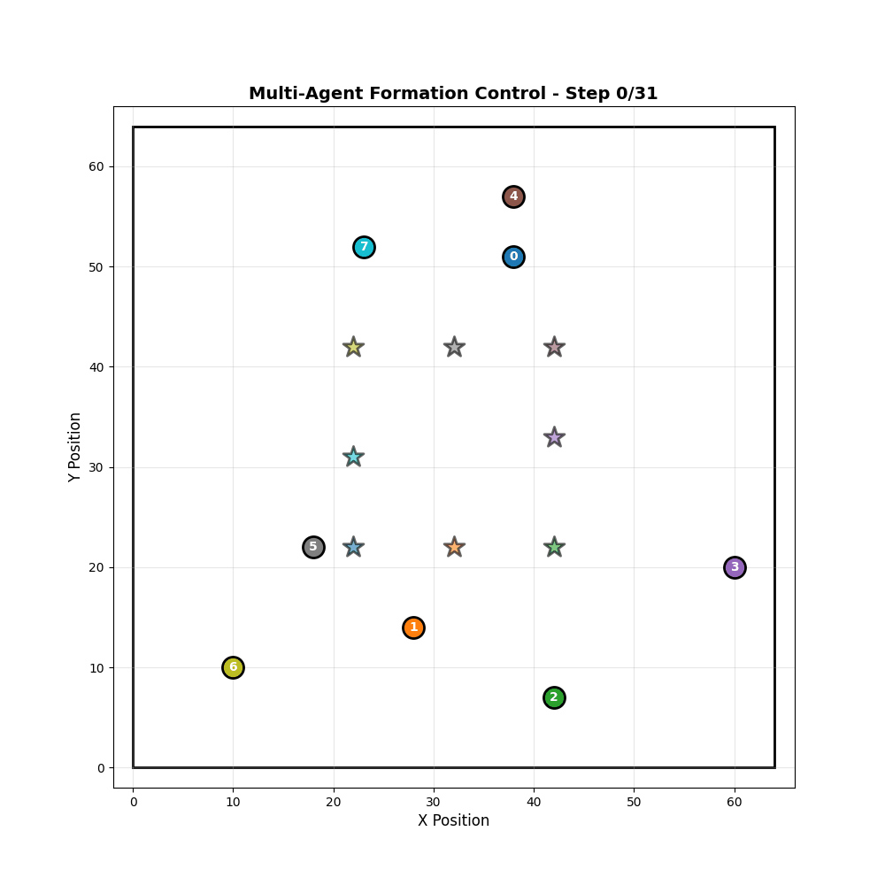
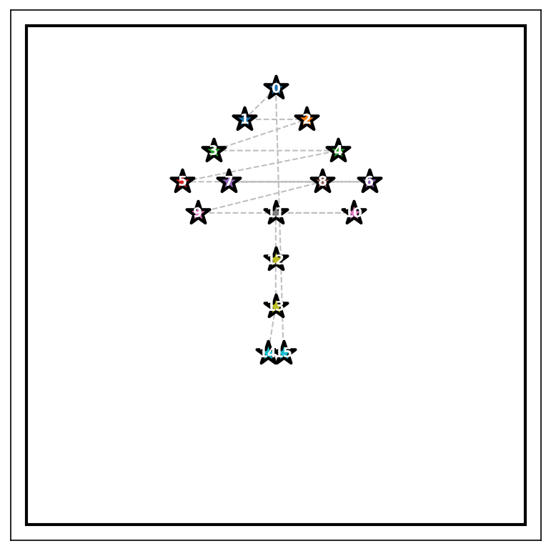
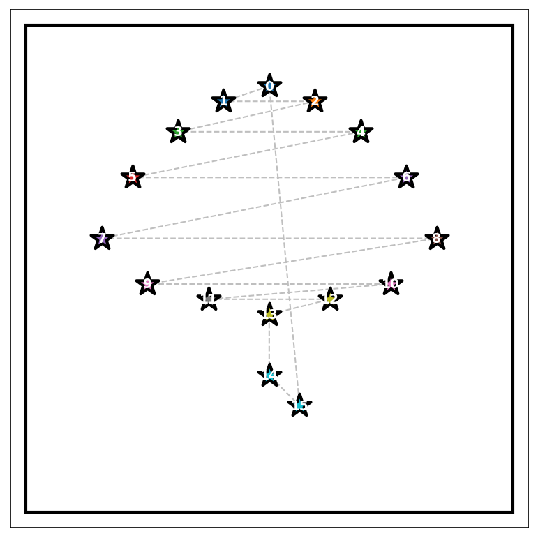
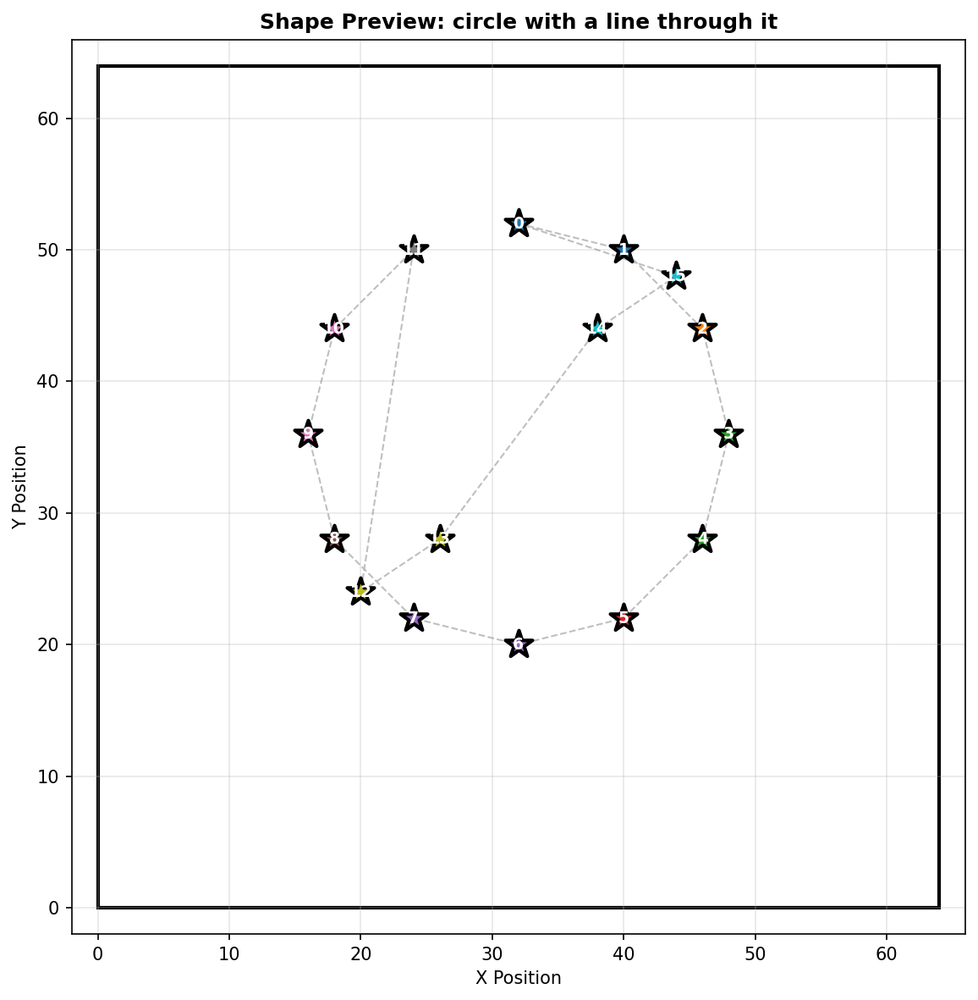
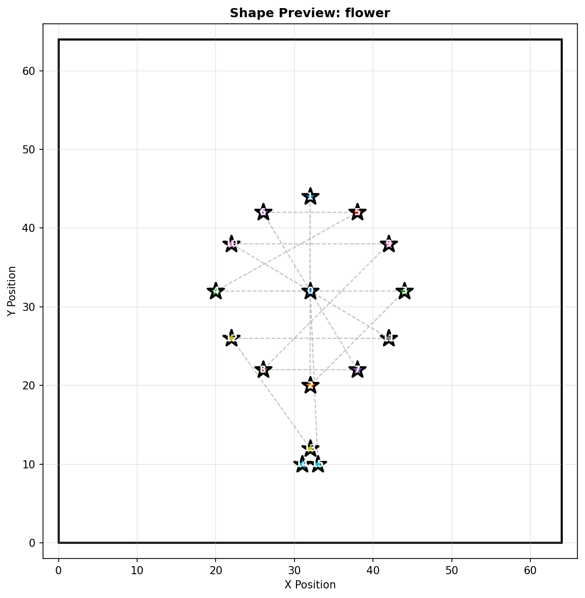
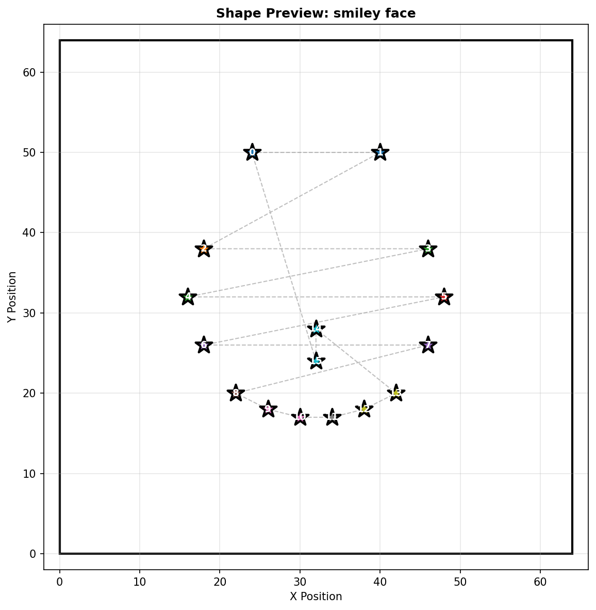
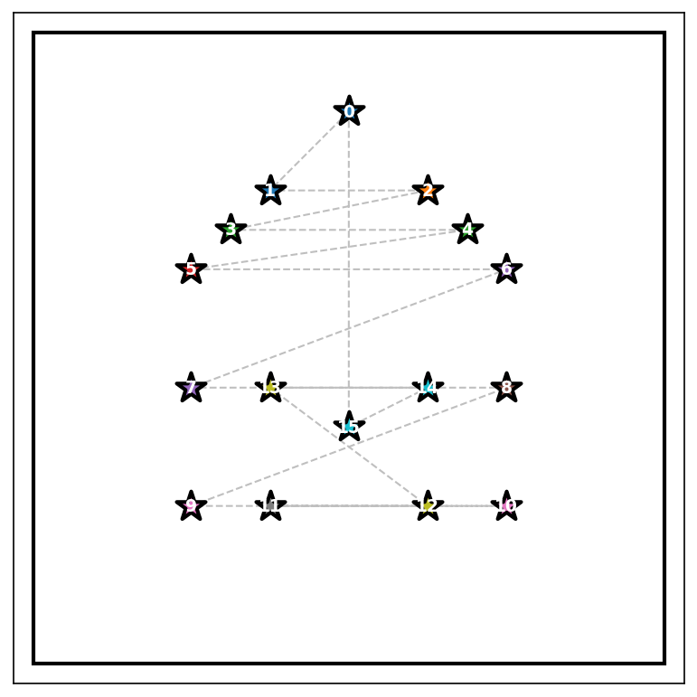

# Language-Conditioned Swarm Formation

Multi-agent RL (MAPPO with CTDE) for swarm formation control on a 64×64 grid. Agents learn to assemble into geometric shapes from natural language descriptions — either via an LLM or built-in geometry. Includes a CBS classical planner baseline and a Raspberry Pi RGB LED display.

## Quick Start

```bash
pip install -r requirements.txt
export OPENAI_API_KEY="your-key-here"   # only needed for LLM shape generation
```

## Usage

### Train

```bash
# General policy (random targets, recommended)
python main.py --mode train --trainer improved --random_targets \
    --n_agents 8 --n_episodes 10000 --actor_type mlp

# Fixed shape
python main.py --mode train --shape circle --n_agents 8 --n_episodes 5000

# Resume from checkpoint
python main.py --mode train --trainer improved --random_targets \
    --n_agents 8 --n_episodes 8300 --actor_type mlp --resume_episode 1700
```

### Evaluate

```bash
python main.py --mode eval --trainer improved --random_targets \
    --n_agents 8 --actor_type mlp --visualize
```

### CBS Baseline

```bash
python cbs_solver.py --shape circle --n_agents 8 --vis_dir visualizations/cbs
```

### Shape Preview

```bash
python shape_preview.py --shape tree --n_agents 8 --no_show --vis_dir visualizations/shape_preview
```

### Raspberry Pi LED Display

```bash
python pi/interactive_display.py --text-input                    # MAPPO policy, text input
python pi/interactive_display.py --text-input --cbs --llm-agents # CBS planner, LLM agent count
```

## Architecture

**Environment** — PettingZoo parallel env, 64×64 grid, 9 discrete actions (stay + 8 directions).

**Observation** — 11×11×3 local grid patch + self position + target position + velocity.

**Actor** — CNN (~587K params, default) or MLP (~231K params). Both output action logits over 9 actions.

**Critic** — Centralized MLP over global state (all agent positions + targets). Used only during training (CTDE).

**MAPPO** — Clipped surrogate PPO with GAE, 10 epochs per rollout. Improved trainer adds value normalization and Huber critic loss.

**Target generation** — `llm/shape_gen.py` calls OpenAI API or uses built-in geometry.

**CBS baseline** — `cbs_solver.py` runs conflict-based search for optimal collision-free paths.

## Visualizations

### CBS Planner — Square Formation



### MAPPO Policy — Diamond Formation


### LLM-Generated Shapes (shape_preview.py)

| Tree (16 agents) | Umbrella (16 agents) |
|---|---|
|  |  |

| Circle w/ line (16 agents) | Flower (16 agents) |
|---|---|
|  |  |

| Smiley face (16 agents) | Home (16 agents) |
|---|---|
|  |  |

## Key Arguments

| Flag | Default | Description |
|------|---------|-------------|
| `--mode` | — | `train`, `eval`, `demo` |
| `--trainer` | `baseline` | `baseline` or `improved` |
| `--actor_type` | `cnn` | `cnn` or `mlp` |
| `--n_agents` | 4 | Number of agents |
| `--shape` | `circle` | Shape name (LLM or built-in) |
| `--random_targets` | off | Sample random targets each episode |
| `--n_episodes` | 1000 | Training episodes |
| `--obs_radius` | 5 | Local observation radius (→ 11×11 patch) |
| `--visualize` | off | Save plots and GIFs |
| `--vis_dir` | `visualizations` | Output directory |
| `--resume_episode` | — | Resume from checkpoint (improved trainer only) |
| `--device` | `auto` | `auto`, `cpu`, `cuda` |

## Model Checkpoints

- Baseline: `models/baseline/actor_{type}_final.pt`
- Improved: `models/improved/actor_mlp_final.pt`
- Intermediate checkpoints saved every 100 episodes (gitignored; only finals are tracked)

## References

- MAPPO: https://arxiv.org/abs/2103.01955
- PettingZoo: https://pettingzoo.farama.org/
- PPO: https://arxiv.org/abs/1707.06347
